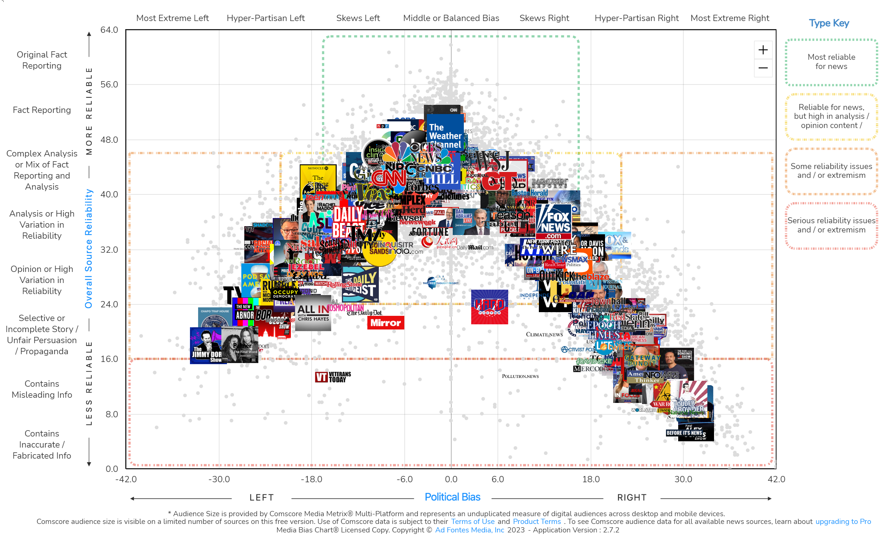

```{r setup, include = FALSE}
knitr::opts_chunk$set(echo = TRUE,
                      warnings = FALSE,
                      messages = FALSE)
```

## Introduction

The American National Election Studies (ANES) surveys eligible U.S. voters before and after presidential elections on various topics. For the 2020 pre-election survey, new questions were added on topics such as sexual harassment, health insurance, identity politics, immigration, media trust, institutional legitimacy, campaigns, party images, trade tariffs, and tax policy. Data collection started in August 2020 and ended on election day, November 3rd, 2020.

Ad Fontes Media is a non-partisan group that rates media sources based on their political bias and reliability. The media bias project evaluates individual news articles, TV shows, and radio programs using a three-analyst rating system, each with different political leanings.



The purpose of the analysis is to combine data from the ANES survey with the Ad Fontes Media project to examine variations in empathy, family politics, self-censorship, and sexism based on the media bias and reliability scores of the media consumed by each respondent.

### Research Questions

1. Do responses to questions on empathy and family politics vary by party affiliation?
2. Are responses to questions on empathy and family politics associated with bias and reliability of media outlets?
3. Is there a relationship between responses to questions on empathy and family politics with social media usage?

4. Are any specific media outlets predicitve of empathy or emotion responses?

5. Do more biased media consumers vote in caucuses more often?

## Data

### Variables

#### Emotion

- *V201114* - are things in the country on track
- *V201115* - how hopeful R feels about how things are going in the country
- *V201116* - how afraid R feels about how things are going in the country
- *V201117* - how outraged R feels about how things are going in the country
- *V201118* - how angry R feels about how things are going in the country
- *V201119* - how happy R feels about how things are going in the country
- *V201120* - how worried R feels about how things are going in the country
- *V201121* - how proud R feels about how things are going in the country
- *V201122* - how irritated R feels about how things are going in the country
- *V201123* - how nervous R feels about how things are going in the country

#### Family relations and empathy

- *V202451* - how much have political differences hurt relationships w/family
- *V202452* - how often does R have concerned feelings for other racial/ethnic groups
- *V202453* - how often does R try to understand perspective of other racial/ethnic groups
- *V202454* - how often R imagines how they would feel before criticizing other groups
- *V202455* - how often R feels protective of someone due to race or ethnicity

#### Self-censorship

- *V201626* - need to be more sensitive talking or people too easily offended
- *V201627* - how often self censor

#### Sexism

- *V201639* - women interpret innocent remarks as sexist
- *V201640* - women seek to gain power by getting control over men

#### Political violence

- *V201602* - how much do you feel it is justified for people to use violence to pursue their political goals in this country?
- *V201603* - compared to four years ago, do you think violence used to pursue political goals in the United States has:
- *V201604* - has it [increased/decreased] a great deal, a moderate amount, or a little?
- *V201605x* - Summary of V201603 and V201604

#### Discussing politics

- *V202022* - Do you ever discuss politics with your family or friends?
- *V202023* - How many days in the past week did you talk about politics with family or friends?
- *V202024* - During the past 12 months, have you ever gotten into a political argument with someone, or have you not done this in the past 12 months?

```{r load-libs-and-data, warning = FALSE}
library(tidyverse)

anes <- read_csv("data/raw/anes_timeseries_2020_csv_20220210.csv",
                 show_col_types = FALSE)
```

```{r anes-desc-stats}
dim(anes)
head(anes)
```

Create subsets of the ANES data set for the variables of interest.

```{r anes-subset}
# Pre- (a) and post-election (b) weights
anes_weights <- anes %>%
  select(V200010a:V200010b)

# Party affiliation, registration, and voting
anes_registration <- anes %>%
  select(V201018:V201021) %>%
  select(!V201018z)
         
# Family and emotion, empathy, self-censorship, sexism
anes_emotion <- anes %>%
  select(V201114:V201123, # Emotion about the country
         V202451:V202456, # Family relationships and racial empathy
         V201626:V201627, # Self-censorship
         V201639:V201640, # Sexism
         V201602:V201605x, # Political violence
         V202022:V202024) # Discussing politics

# Pre-election media responses
anes_media <- anes %>%
  select(V201630a:V201630r, # TV programs 1
         V201631a:V201631r, # TV programs 2
         V201633a:V201633r, # Radio programs
         V201634a:V201634c,V201634e:V201634f, V201634h,
         V201634j:V201634q, # Websites not included in online newspapers
         V201636a:V201636d) # Online newspapers

# Post-election social media responses
anes_social_media <- anes %>%
  select(V202541a:V202547) # Note there are post-election
```

### Impute non-respondants

The media variables are coded as:

* -9. Refused
* -5. Interview breakoff (sufficient partial IW)
* -1. Inapplicable
* 0. Not mentioned
* 1. Mentioned

The focus will be on the "Not Mentioned" and "Mentioned" response types, which reflect the respondents' monthly consumption of specific media sources. Other responses will be considered missing and will be filled in as either 0 or 1 using information from other non-response variables in the pre- and post-election survey questions. The imputation technique employed will be Random Forest imputation.

Random Forest imputation is a statistical method used to fill in missing values in a dataset. It uses an ensemble of decision trees (a "forest") to predict missing values. The algorithm works by splitting the dataset into smaller subsets, and building a decision tree for each of these subsets. The final prediction for the missing value is obtained by combining the results of all trees. Random Forest Imputation has the advantage of being more robust to outliers and noise compared to other imputation methods and can handle both continuous and categorical variables.

To simplify the analysis process and reduce computation time, the imputation step has been separated from this document and can be found in the "impute.Rmd" file. The imputed dataset, generated using Random Forest Imputation, is stored in the "data/interim/missForest-imputed.RDS" file and can be accessed there.

The `missForest()` from the `missForest` library will be used to impute the missing values generated above using a random forest model. This approach has the advantage of being able to impute categorical data while handling complex interactions and nonlinear relationships. However, the algorithm has a long computation time, particularly when there are a lot of variables in the dataset.

The function by default will run over 10 iterations and takes a sizeable amount of time with this dataset, so the data was pre-imputed using a parallel backend to save computation time.

The `missForest` algorithm returns a dataframe of the 'best' selected imputed results, in addition to the out-of-box (OOB) proportion of falsely classified (PFC) observations. The OOB-PFC is calculated by predicting on known, unsampled observations to compare against their known values.

```{r read-imputed}
library(missForest) # Load in case of any dependencies when loading a missForest data class
anes_imputed <- readRDS('data/interim/missForest-imputed.RDS')

anes_imputed$OOBerror
```

The OOB-PFC is `r round(anes_imputed$OOBerror[2], 5)`, which can be considered equivalent to ~ 92% accuracy since there are two classes to each of the variables imputed on.

### Bias and Reliability EDA

The following code loads the Ad Fontes Media data and creates an interactive chart displaying the reliability and bias scores for each media source in the ANES dataset that has been scored.

```{r load-ad-fontes-media}
library(plotly)
library(ggrepel)

adfontes <- read_csv('data/raw/adfontes.csv') %>%
  mutate(Media = factor(ifelse(Media == "ONLINE NEWSPAPER",
                               "WEBSITE",
                               Media))) %>%
  drop_na() %>%
  # Remove duplicates created from combining WEBSITE and ONLINE NEWSPAPER
  filter(Code != 'V201634d',
         Code != 'V201634i',
         Code != 'V201634g')

adfontes_plot <- adfontes %>%
  mutate(Outlet = str_remove(Outlet, '\\s\\(.*\\)')) %>%
  ggplot(aes(x = Bias,
             y = Reliability,
             color = Media,
             label = Outlet)) +
  geom_point(alpha = 0.75) +
  scale_x_continuous(limits = c(-35, 35)) +
  scale_color_manual(values = c("steelblue", "goldenrod", "tomato")) +
  theme_bw()

ggplotly(adfontes_plot) %>%
  layout(legend = list(orientation = "h",
                       x = 0.25,
                       y = -0.2))
```

The scatter plot reveals that radio programs typically have a right-leaning bias and low reliability, while websites tend to have a slight left bias and high reliability. TV programs exhibit a wider range of bias and reliability scores. There is some clustering observed around a slight left bias and high reliability. Additionally, the values appear to follow a curvi-linear trend where reliability scores decrease as left or right bias increases.

The following code will calculate and print the average and median reliability and bias scores for each type of media, as well as the count of media sources with a "left", "right", or "center" bias.

```{r}
adfontes %>%
  group_by(Media) %>%
  summarize('Mean Reliability' = mean(Reliability),
            'Median Reliability' = median(Reliability),
            'Mean Bias' = mean(Bias),
            'Median Bias' = median(Bias))
```

Like the scatter plot above, the analysis of the radio programs shows that they tend to have lower reliability scores and a strong right-leaning bias, compared to other media types.

To explore the correlation between bias and reliability, the absolute values of the bias scores will be used to fit a linear model. The results of this model, including the correlation coefficient and p-value, will then be displayed in a replotted version of the data.

```{r adfontes-bias-rel-corr}
# Create a linear model predicting Reliability by the abs val of Bias
bias_rel_fit <- summary(lm(Reliability ~ abs(Bias),
                   data = adfontes))

adfontes_plot <- adfontes %>%
  ggplot(aes(x = abs(Bias),
             y = Reliability,
             color = Media,
             label = Outlet)) +
  geom_point(alpha = 0.75) +
  geom_abline(slope = bias_rel_fit$coefficients[2, 1],
              intercept = bias_rel_fit$coefficients[1, 1],
              lty = 'dashed') +
  annotate('text',
           x = 22.5,
           y = 40,
           label = paste0('r^2 = ', round(bias_rel_fit$r.squared, 3),
                          '\np < 0.001')) +
  scale_color_manual(values = c("steelblue", "goldenrod", "tomato")) +
  theme_bw() 

ggplotly(adfontes_plot) %>%
  layout(legend = list(orientation = "h",
                       x = 0.25,
                       y = -0.2))
```

The relationship between reliability and bias appears to be strong and linear, as evidenced by the transformation of the curvi-linear distribution of the reliability and bias scores into a strongly linear one upon taking the absolute value of the bias scores. This suggests that there is a strong correlation between reliability and bias, regardless of whether the bias is "left" or "right," and that this relationship remains consistent across all types of media.

The ANES media variables will be limited to only those that have received bias and reliability scores from Ad Fontes Media. This step was not taken prior to imputation as it was believed that the full set of variables could play a crucial role in accurately predicting missing values in the bagged tree imputation process.

The relationship between reliability and bias appears to be strong and linear, as evidenced by the transformation of the curvi-linear distribution of the reliability and bias scores into a strongly linear one upon taking the absolute value of the bias scores. This suggests that there is a strong correlation between reliability and bias, regardless of whether the bias is "left" or "right," and that this relationship remains consistent across all types of media.

The ANES media variables will be limited to only those that have received bias and reliability scores from Ad Fontes Media. This step was not taken prior to imputation as it was believed that the full set of variables could play a crucial role in accurately predicting missing values in the bagged tree imputation process.

```{r keep-adfontes-vars}
# Keep only the media vars that have Reliability and Bias scores
media_codes <- adfontes %>%
  pull(Code)
  
anes_imputed_media <- anes_imputed$ximp %>%
  select(all_of(media_codes)) %>%
  # Convert to character then to numeric to avoid re-coding by going straight from factor to numeric
  mutate(across(everything(), ~ as.numeric(as.character(.))))
```

The total, average, and median Bias and Reliability scores for the media consumed by each participant will be calculated. Bias will also be left as-is so that respondents who consume media equally on both sides can be centered (toward 0).

```{r bias-rel-sum-stats}
# Set 0's in the media vars to NA so they are not calculated and to allow for Bias == 0 to be
# included
anes_imputed_media[anes_imputed_media == 0] <- NA

# Multiply col-wise to get the Bias and Reliability within each column
anes_imputed_media_bias <- anes_imputed_media *
  adfontes$Bias[match(names(anes_imputed_media),
                      adfontes$Code)][col(anes_imputed_media)]

anes_imputed_media_rel <- anes_imputed_media *
  adfontes$Reliability[match(names(anes_imputed_media),
                             adfontes$Code)][col(anes_imputed_media)]

anes_imputed_media <- anes_imputed_media %>%
  mutate(Total_Bias = rowSums(anes_imputed_media_bias,
                              na.rm = TRUE),
         Total_Rel = rowSums(anes_imputed_media_rel,
                             na.rm = TRUE),
         # Get the average Bias and Reliability based on the media consumed for each respondent
         # This will create NaN values for respondents with all 0 values
         Avg_Bias = Total_Bias / rowSums(!is.na(anes_imputed_media_bias)),
         Avg_Rel = Total_Rel / rowSums(!is.na(anes_imputed_media_rel)))

# Get the row-wise median for bias and reliability
# Will return NA in rows without any values
anes_imputed_media$Median_Bias <- apply(anes_imputed_media_bias,
                                        1,
                                        function(x) median(x[x !=0],
                                                           na.rm = TRUE))
anes_imputed_media$Median_Rel <- apply(anes_imputed_media_rel,
                                       1,
                                       function(x) median(x[x != 0],
                                                          na.rm = TRUE))

# Replace NaN and NA values with 0
anes_imputed_media <- anes_imputed_media %>%
  mutate(across(c(Avg_Bias, Avg_Rel),
                ~ replace(., is.nan(.), 0)),
         across(c(Median_Bias, Median_Rel),
                ~ replace(., is.na(.), 0)))

# Reset the NAs to 0
anes_imputed_media[is.na(anes_imputed_media)] <- 0

anes_imputed_media %>%
  select(Total_Bias:Median_Rel) %>%
  pivot_longer(everything()) %>%
  ggplot(aes(x = value)) +
    geom_histogram(bins = 30) +
    facet_wrap(~ name, scales = 'free') +
    theme_classic()
```

As expected, the number of *not mentioned* ('0') values dominates most of the distributions. We should remove any respondents who did not consume any of the medias (have reliability = 0).

```{r}
anes_imputed_media %>%
  select(Total_Bias:Median_Rel) %>%
  filter(Total_Rel != 0) %>%
  pivot_longer(everything()) %>%
  ggplot(aes(x = value)) +
    geom_histogram(bins = 30) +
    facet_wrap(~ name, scales = 'free') +
    theme_classic()
```

After removal the data is still non-normal, but approachable for modeling. The most normal is *Total_Bias*, which centers slightly left and has a right skew. 

