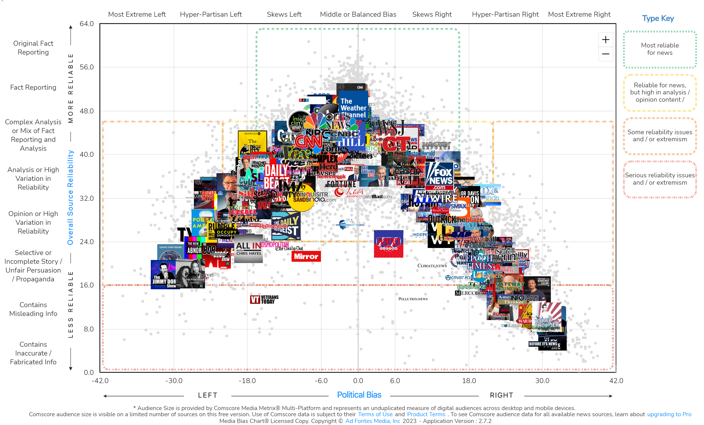

```{r setup, include = FALSE}
knitr::opts_chunk$set(echo = TRUE,
                      warnings = FALSE,
                      messages = FALSE)
```

## Introduction

The American National Election Studies (ANES) surveys eligible U.S. voters before and after presidential elections on various topics. For the 2020 pre-election survey, new questions were added on topics such as sexual harassment, health insurance, identity politics, immigration, media trust, institutional legitimacy, campaigns, party images, trade tariffs, and tax policy. Data collection started in August 2020 and ended on election day, November 3rd, 2020.

Ad Fontes Media is a non-partisan group that rates media sources based on their political bias and reliability. The media bias project evaluates individual news articles, TV shows, and radio programs using a three-analyst rating system, each with different political leanings.



The purpose of the analysis is to combine data from the ANES survey with the Ad Fontes Media project to examine variations in empathy, family politics, self-censorship, and sexism based on the media bias and reliability scores of the media consumed by each respondent.

### Research Questions

1. Do responses to questions on empathy and family politics vary by party affiliation?
2. Are responses to questions on empathy and family politics associated with bias and reliability of media outlets?
3. Is there a relationship between responses to questions on empathy and family politics with social media usage?

4. Are any specific media outlets predicitve of empathy or emotion responses?

5. Do more biased media consumers vote in caucuses more often?

## Data

### Variables

#### Emotion

- *V201114* - are things in the country on track
- *V201115* - how hopeful R feels about how things are going in the country
- *V201116* - how afraid R feels about how things are going in the country
- *V201117* - how outraged R feels about how things are going in the country
- *V201118* - how angry R feels about how things are going in the country
- *V201119* - how happy R feels about how things are going in the country
- *V201120* - how worried R feels about how things are going in the country
- *V201121* - how proud R feels about how things are going in the country
- *V201122* - how irritated R feels about how things are going in the country
- *V201123* - how nervous R feels about how things are going in the country

#### Family relations and empathy

- *V202451* - how much have political differences hurt relationships w/family
- *V202452* - how often does R have concerned feelings for other racial/ethnic groups
- *V202453* - how often does R try to understand perspective of other racial/ethnic groups
- *V202454* - how often R imagines how they would feel before criticizing other groups
- *V202455* - how often R feels protective of someone due to race or ethnicity

#### Self-censorship

- *V201626* - need to be more sensitive talking or people too easily offended
- *V201627* - how often self censor

#### Sexism

- *V201639* - women interpret innocent remarks as sexist
- *V201640* - women seek to gain power by getting control over men

```{r load-libs-and-data, warning = FALSE}
library(tidyverse)

anes <- read_csv("data/raw/anes_timeseries_2020_csv_20220210.csv",
                 show_col_types = FALSE)
```

```{r anes-desc-stats}
dim(anes)
head(anes)
```

Create subsets of the ANES data set for the variables of interest.

```{r anes-subset}
# Pre- (a) and post-election (b) weights
anes_weights <- anes %>%
  select(V200010a:V200010b)

# Party affiliation, registration, and voting
anes_registration <- anes %>%
  select(V201018:V201021) %>%
  select(!V201018z)
         
# Family and emotion, empathy, self-censorship, sexism
anes_emotion <- anes %>%
  select(V201114:V201123, # emotion about the country
         V202451:V202456, # family and empathy
         V201626:V201627, # self-censorship
         V201639:V201640) # sexism

# Pre-election media responses
anes_media <- anes %>%
  select(V201630a:V201630r, # TV programs 1
         V201631a:V201631r, # TV programs 2
         V201633a:V201633r, # Radio programs
         V201634a:V201634c,V201634e:V201634f, V201634h,
         V201634j:V201634q, # Websites not included in online newspapers
         V201636a:V201636d) # Online newspapers

# Post-election social media responses
anes_social_media <- anes %>%
  select(V202541a:V202547) # Note there are post-election
```

### Impute non-respondants

The media variables are coded as:

* -9. Refused
* -5. Interview breakoff (sufficient partial IW)
* -1. Inapplicable
* 0. Not mentioned
* 1. Mentioned

The focus will be on the "Not Mentioned" and "Mentioned" response types, which reflect the respondents' monthly consumption of specific media sources. Other responses will be considered missing and will be filled in as either 0 or 1 using information from other non-response variables in the pre- and post-election survey questions. The imputation technique employed will be Random Forest imputation.

Random Forest imputation is a statistical method used to fill in missing values in a dataset. It uses an ensemble of decision trees (a "forest") to predict missing values. The algorithm works by splitting the dataset into smaller subsets, and building a decision tree for each of these subsets. The final prediction for the missing value is obtained by combining the results of all trees. Random Forest Imputation has the advantage of being more robust to outliers and noise compared to other imputation methods and can handle both continuous and categorical variables.

To simplify the analysis process and reduce computation time, the imputation step has been separated from this document and can be found in the "impute.Rmd" file. The imputed dataset, generated using Random Forest Imputation, is stored in the "data/interim/missForest-imputed.RDS" file and can be accessed there.

```{r read-imputed}
anes_imputed <- readRDS('data/interim/missForest-imputed.RDS')
```

### Bias and Reliability EDA

The following code can be used to bring in the Ad Fontes Media data and create an interactive chart displaying the reliability and bias scores for each media source in the ANES dataset that has been scored.

```{r load-ad-fontes-media}
library(plotly)

adfontes <- read_csv('data/raw/adfontes.csv') %>%
  mutate(Media = factor(ifelse(Media == "ONLINE NEWSPAPER",
                               "WEBSITE",
                               Media))) %>%
  drop_na() %>%
  # Remove duplicates created from combining WEBSITE and ONLINE NEWSPAPER
  filter(Code != 'V201634d',
         Code != 'V201634i',
         Code != 'V201634g')

adfontes_plot <- adfontes %>%
  ggplot(aes(x = Bias,
             y = Reliability,
             color = Media,
             label = Outlet)) +
  geom_point(alpha = 0.75) +
  scale_x_continuous(limits = c(-35, 35)) +
  scale_color_manual(values = c("steelblue", "goldenrod", "tomato")) +
  theme_bw() 

ggplotly(adfontes_plot) %>%
  layout(legend = list(orientation = "h",
                       x = 0.25,
                       y = -0.2))
```

The scatter plot reveals that radio programs typically have a right-leaning bias and low reliability, while websites tend to have a slight left bias and high reliability. TV programs exhibit a wider range of bias and reliability scores. There is some clustering observed around a slight left bias and high reliability. Additionally, the values appear to follow a curvi-linear trend where reliability scores decrease as left or right bias increases.

The following code will calculate and print the average and median reliability and bias scores for each type of media, as well as the count of media sources with a "left", "right", or "center" bias.

```{r}
adfontes %>%
  group_by(Media) %>%
  summarize(mean_rel = mean(Reliability),
            median_rel = median(Reliability),
            mean_bias = mean(Bias),
            median_bias = median(Bias))
```

Like the scatter plot mentioned earlier, the analysis of the radio programs shows that they tend to have lower reliability scores and a strong right-leaning bias, compared to other media types.

To explore the correlation between bias and reliability, the absolute values of the bias scores will be used to fit a linear model. The results of this model, including the correlation coefficient and p-value, will then be displayed in a replotted version of the data.

```{r adfontes-bias-rel-corr}
# Create a linear model predicting Reliability by the abs val of Bias
bias_rel_fit <- summary(lm(Reliability ~ abs(Bias),
                   data = adfontes))

adfontes_plot <- adfontes %>%
  ggplot(aes(x = abs(Bias),
             y = Reliability,
             color = Media,
             label = Outlet)) +
  geom_point(alpha = 0.75) +
  geom_abline(slope = bias_rel_fit$coefficients[2, 1],
              intercept = bias_rel_fit$coefficients[1, 1],
              lty = 'dashed') +
  annotate('text',
           x = 22.5,
           y = 40,
           label = paste0('r^2 = ', round(bias_rel_fit$r.squared, 3),
                          '\np < 0.001')) +
  scale_x_continuous(limits = c(0, 35)) +
  scale_color_manual(values = c("steelblue", "goldenrod", "tomato")) +
  theme_bw() 

ggplotly(adfontes_plot) %>%
  layout(legend = list(orientation = "h",
                       x = 0.25,
                       y = -0.2))
```

The relationship between reliability and bias appears to be strong and linear, as evidenced by the transformation of the curvi-linear distribution of the reliability and bias scores into a strongly linear one upon taking the absolute value of the bias scores. This suggests that there is a strong correlation between reliability and bias, regardless of whether the bias is "left" or "right," and that this relationship remains consistent across all types of media.

The ANES media variables will be limited to only those that have received bias and reliability scores from Ad Fontes Media. This step was not taken prior to imputation as it was believed that the full set of variables could play a crucial role in accurately predicting missing values in the bagged tree imputation process.

```{r keep-adfontes-vars}
# Keep only the media vars that have Reliability and Bias scores
media_codes <- adfontes %>%
  pull(Code)
  
anes_imputed_media <- anes_imputed$ximp %>%
  select(all_of(media_codes)) %>%
  # Convert to character then to numeric to avoid re-coding by going straight from factor to numeric
  mutate(across(everything(), as.character),
         across(everything(), as.numeric))
```

The total, average, and median Bias and Reliability scores for the media consumed by each participant will be calculated. Bias will also be left as-is so that respondents who consume media equally on both sides can be centered (toward 0).

```{r bias-rel-sum-stats}
# Set 0's in the media vars to NA so they are not calculated and to allow for Bias == 0 to be
# included

anes_imputed_media[anes_imputed_media == 0] <- NA

# Multiply col-wise to get the Bias and Reliability within each column
anes_imputed_media_bias <- anes_imputed_media *
  adfontes$Bias[match(names(anes_imputed_media),
                      adfontes$Code)][col(anes_imputed_media)]

anes_imputed_media_rel <- anes_imputed_media *
  adfontes$Reliability[match(names(anes_imputed_media),
                             adfontes$Code)][col(anes_imputed_media)]

anes_imputed_media <- anes_imputed_media %>%
  mutate(Total_Bias = rowSums(anes_imputed_media_bias,
                              na.rm = TRUE),
         Total_Rel = rowSums(anes_imputed_media_rel,
                             na.rm = TRUE),
         # Get the average Bias and Reliability based on the media consumed for each respondent
         # This will create NaN values for respondents with all 0 values
         Avg_Bias = Total_Bias / rowSums(!is.na(anes_imputed_media_bias)),
         Avg_Rel = Total_Rel / rowSums(!is.na(anes_imputed_media_rel)))

# Get the row-wise median for bias and reliability
# Will return NA in rows without any values
anes_imputed_media$Median_Bias <- apply(anes_imputed_media_bias,
                                        1,
                                        function(x) median(x[x !=0],
                                                           na.rm = TRUE))
anes_imputed_media$Median_Rel <- apply(anes_imputed_media_rel,
                                       1,
                                       function(x) median(x[x != 0],
                                                          na.rm = TRUE))

# Replace NaN and NA values with 0
anes_imputed_media <- anes_imputed_media %>%
  mutate(across(c(Avg_Bias, Avg_Rel),
                ~ replace(., is.nan(.), 0)),
         across(c(Median_Bias, Median_Rel),
                ~ replace(., is.na(.), 0)))


anes_imputed_media %>%
  select(Total_Bias:Median_Rel) %>%
  pivot_longer(everything()) %>%
  ggplot(aes(x = value)) +
    geom_histogram(bins = 30) +
    facet_wrap(~ name, scales = 'free') +
    theme_classic()
```

## Analysis

### Empathy


```{r}
# Bind the weights, party affiliation, and empathy var columns
anes_to_model <- anes_registration %>%
  bind_cols(anes_weights, anes_emotion, anes_imputed_media)

# Plot the total number of respondents in each political affiliation
anes_to_model %>%
  select(V201018) %>%
  group_by(V201018) %>%
  summarize(n = n()) %>%
  ggplot(aes(x = ordered(V201018),
             y = n)) +
    geom_col() +
    scale_x_discrete(labels = c('Refused', 'Dont Know', 'Inapplicable', 'D', 'R', 'I', 'Other')) +
    theme_classic()
```

Create a data frame in long format for plotting the weights, empathy, party affiliation, and bias/reliability variables.

```{r}
anes_empathy_df <- anes_to_model %>%
  select(V200010a, # Pre-election weights
         V201018, # Party registration
         V202451:V202455, # Empathy
         Total_Bias:last_col()) %>%
  pivot_longer(V202451:V202455,
               names_to = 'empathy',
               values_to = 'value') %>%
  # Filter out non-respondents for empathy questions 
  filter(value > 0,
         # Filter respondents who did not consume any of the media sources, which would have
         # a reliability score = 0
         Avg_Rel != 0) %>%
  mutate(Abs_Bias = abs(Avg_Bias), # New variable with absolute value of bias
         # New variable that indicates direction of bias
         Dir_Bias = factor(case_when(Avg_Bias > 15 ~ 2,
                                     Avg_Bias < -15 ~ -2,
                                     Avg_Bias <= 15 & Avg_Bias > 5 ~ 1, 
                                     Avg_Bias >= -15 & Avg_Bias < -5 ~ -1,
                                     TRUE ~ 0),
                           levels = c(0, -2, -1, 1, 2)),
         value = ordered(value)) # Set the response to an ordered factor

anes_empathy_df %>%
  ggplot(aes(x = Abs_Bias,
             y = Avg_Rel,
             color = value)) +
  geom_point(alpha = 0.25) +
  facet_wrap(~ empathy) +
  theme_bw()


# Plot Reliability vs Bias for political party affiliation
anes_plt_df %>%
  select(!c(empathy, value)) %>%
  distinct() %>%
  filter(V201018 >= -1) %>%
  ggplot(aes(x = Median_Bias,
             y = Median_Rel,
             color = ordered(V201018))) +
  geom_point(alpha = 0.25)

# Do the same plot but with only R, D, and I and recolored
anes_plt_df %>%
  select(!c(empathy, value)) %>%
  distinct() %>%
  filter(V201018 %in% c(1, 2, 4, 5),
         Avg_Bias != 0 & Avg_Rel != 0) %>%
  ggplot(aes(x = Avg_Bias,
             y = Avg_Rel,
             color = ordered(V201018))) +
  geom_point(alpha = 0.25) +
  scale_color_manual(values = c('blue', 'red', 'grey50', 'green'),
                     labels = c('Democrat', 'Republican', 'Independent', 'Other')) +
  scale_x_continuous(limits = c(-35, 35)) +
  labs(x = "Average bias",
       y = "Average reliability",
       color = 'Party affiliation') +
  theme_bw()

# Plot Reliability vs Bias for each of the fampol and empathy
anes_plt_df %>%
  filter(Avg_Bias != 0 & Avg_Rel != 0) %>%
  ggplot(aes(x = Avg_Bias,
             y = Avg_Rel,
             color = value)) +
  geom_point(alpha = 0.25) +
  facet_wrap(~ empathy) +
  theme_bw()
```

#### Multinomial logistic regression

```{r}
library(VGAM)

fit <- anes_empathy_df %>%
  filter(empathy == "V202452") %>%
  vglm(formula = value ~ Avg_Rel + Abs_Bias + Dir_Bias,
       weights = V200010a,
       family = cumulative(parallel = TRUE))

summary(fit)

fit_preds <- predict(fit, type = 'response')

preds <- apply(fit_preds, 1, which.max)

summary(preds)
```


```{r}
library(VGAM)

anes_empathy1_df <- anes_empathy_df %>%
  filter(empathy == 'V202455')

# Modify case weights based on total responses to the response question
# Example weight = original weight * downsampling factor
n_samples <- nrow(anes_empathy1_df)
n_classes <- length(unique(anes_empathy1_df$value))
anes_empathy1_df_case_wts <- anes_empathy1_df %>%
  group_by(value) %>%
  summarize(n_samples_j = n(),
            case_wts = n_samples / (n_classes * n_samples_j))

anes_empathy1_df <- anes_empathy1_df %>%
  left_join(anes_empathy1_df_case_wts,
            by = 'value') %>%
  mutate(wts = V200010a * case_wts)

# Model using average bias and reliability
fit <- anes_empathy1_df %>%
  vglm(formula = value ~ Avg_Rel + Avg_Bias,
       weights = wts,
            family = cumulative(link = 'logit',
                                parallel = TRUE))

summary(fit)

# Model using the absolute value of average bias with a directional term
fit2 <- anes_empathy1_df %>%
  vglm(formula = value ~ Avg_Rel + Abs_Bias + Dir_Bias,
       weights = wts,
            family = cumulative(link = 'logit',
                                parallel = TRUE))

summary(fit2)

# Model using Total_Bias and no directional term
fit3 <- anes_empathy1_df %>%
  vglm(formula = value ~ Avg_Rel + Total_Bias,
       weights = wts,
            family = cumulative(link = 'logit',
                                parallel = TRUE))

summary(fit3)

null_fit <- anes_empathy1_df %>%
  vglm(formula = value ~ 1,
       weights = wts,
            family = cumulative(link = 'logit',
                                parallel = TRUE))

logLik(null_fit)
logLik(fit)
logLik(fit2)
logLik(fit3)

logLik(fit) - logLik(null_fit)
logLik(fit2) - logLik(fit)

anova(fit, test = 'LR')

fit_preds <- predict(fit2, type = 'response')

preds <- apply(fit_preds, 1, which.max)

table(anes_empathy1_df$value,
      preds)

anes_empathy1_df %>%
  mutate(Dir_Bias = factor(Dir_Bias,
                           levels = c(-2, -1, 0, 1, 2))) %>%
ggplot(aes(y = Dir_Bias,
           fill = value)) +
  geom_bar(position = 'fill') +
  scale_y_discrete(labels = c('Left', 'Center-left', 'Center', 'Center-right', 'Right')) +
  theme_bw() +
  labs(x = 'Proportion',
       y = 'Bias leaning',
       fill = 'Response')

# Graph average reliability vs bias
anes_empathy1_df %>%
  mutate(Dir_Bias = factor(Dir_Bias,
                           levels = c(-2, -1, 0, 1, 2))) %>%
  ggplot(aes(x = Avg_Bias,
             y = Avg_Rel,
             color = Dir_Bias)) +
  geom_vline(xintercept = c(-15, -5, 5, 15),
             lty = 3) +
  geom_point(alpha = 0.25) +
  scale_x_continuous(limits = c(-32, 32)) +
  scale_color_manual(values = c('blue', '#979acf', 'grey50', '#cf97a0', 'red')) +
  annotate(geom = 'text',
           x = c(-20, -10, 0, 10, 20),
           y = rep(55, 5),
           label = c('Left', 'Center-left', 'Center', 'Center-right', 'Right')) +
  theme_bw() +
  theme(legend.position = 'none') +
  labs(x = "Average Bias",
       y = "Average Reliability")

# Graph median reliability vs bias
anes_empathy1_df %>%
  mutate(Dir_Bias = factor(case_when(Median_Bias > 15 ~ 2,
                                     Median_Bias < -15 ~ -2,
                                     Median_Bias <= 15 & Median_Bias > 5 ~ 1, 
                                     Median_Bias >= -15 & Median_Bias < -5 ~ -1,
                                     TRUE ~ 0),
                           levels = c(-2, -1, 0, 1, 2))) %>%
  ggplot(aes(x = Median_Bias,
             y = Median_Rel,
             color = Dir_Bias)) +
  geom_vline(xintercept = c(-15, -5, 5, 15),
             lty = 3) +
  geom_point(alpha = 0.25) +
  scale_x_continuous(limits = c(-32, 32)) +
  scale_color_manual(values = c('blue', '#979acf', 'grey50', '#cf97a0', 'red')) +
  annotate(geom = 'text',
           x = c(-20, -10, 0, 10, 20),
           y = rep(55, 5),
           label = c('Left', 'Center-left', 'Center', 'Center-right', 'Right')) +
  theme_bw() +
  theme(legend.position = 'none') +
  labs(x = "Average Bias",
       y = "Average Reliability")

# Graph Average reliability vs Total bias
anes_empathy1_df %>%
  mutate(Dir_Bias = factor(case_when(Total_Bias > 75 ~ 2,
                                     Total_Bias < -75 ~ -2,
                                     Total_Bias <= 75 & Total_Bias > 25 ~ 1, 
                                     Total_Bias >= -75 & Total_Bias < -25 ~ -1,
                                     TRUE ~ 0),
                           levels = c(-2, -1, 0, 1, 2))) %>%
  ggplot(aes(x = Total_Bias,
             y = Avg_Rel,
             color = Dir_Bias)) +
  geom_vline(xintercept = c(-75, -25, 25, 75),
             lty = 3) +
  geom_point(alpha = 0.25) +
  scale_x_continuous(limits = c(-250, 250)) +
  scale_color_manual(values = c('blue', '#979acf', 'grey50', '#cf97a0', 'red')) +
  annotate(geom = 'text',
           x = c(-150, -50, 0, 50, 150),
           y = rep(55, 5),
           label = c('Left', 'Center-\nleft', 'Center', 'Center-\nright', 'Right')) +
  theme_bw() +
  theme(legend.position = 'none') +
  labs(x = "Total bias",
       y = "Average reliability")

```


## Statistical Analysis

```{r}
library(rstatix)

# Kruskal-Wallis test to see if respondents vary on empathy based on political party
anes_plt_df %>%
  filter(V201018 %in% c(1, 2, 4)) %>%
  group_by(empathy) %>%
  kruskal_test(V201018 ~ value) %>%
  adjust_pvalue()

# Kruskal-Wallis test to see if respondents vary on empathy based on median Bias
anes_plt_df %>%
  filter(V201018 %in% c(1, 2, 4)) %>%
  group_by(empathy) %>%
  kruskal_test(Median_Bias ~ value) %>%
  adjust_pvalue()

# Kruskal-Wallis test to see if respondents vary on empathy based on median Reliability
anes_plt_df %>%
  filter(V201018 %in% c(1, 2, 4)) %>%
  group_by(empathy) %>%
  kruskal_test(Median_Rel ~ value) %>%
  adjust_pvalue()


anes_plt_df %>%
  filter(V201018 %in% c(1, 2, 4)) %>%
  group_by(V201018, empathy, value) %>%
  summarize(n = n()) %>%
  ggplot(aes(x = ordered(V201018),
             y = n,
             fill = value)) +
    geom_col(position = 'fill') +
    facet_wrap(~ empathy)
  
```

```{r}
fampol_diffhurt <- anes_plt_df %>%
  filter(empathy == 'V202451',
         Median_Bias != 0 & Median_Rel != 0)

# Example weight = original weight * downsampling factor
n_samples <- nrow(fampol_diffhurt)
n_classes <- length(unique(fampol_diffhurt$value))
fampol_diffhurt_case_wts <- fampol_diffhurt %>%
  group_by(value) %>%
  summarize(n_samples_j = n(),
            case_wts = n_samples / (n_classes * n_samples_j))

fampol_diffhurt$case_wts <- fampol_diffhurt %>%
  select(value) %>%
  mutate(case_wts = case_when(value == 1 ~ fampol_diffhurt_case_wts$case_wts[1],
                              value == 2 ~ fampol_diffhurt_case_wts$case_wts[2],
                              value == 3 ~ fampol_diffhurt_case_wts$case_wts[3],
                              value == 4 ~ fampol_diffhurt_case_wts$case_wts[4],
                              value == 5 ~ fampol_diffhurt_case_wts$case_wts[5])) %>%
  pull(case_wts)

fampol_diffhurt$wts <- fampol_diffhurt$V200010b * fampol_diffhurt$case_wts

library(VGAM)

fit <- vglm(formula = value ~ Median_Bias * Median_Rel,
            data = fampol_diffhurt,
            weights = wts,
            family = cumulative(parallel = TRUE))

summary(fit)

fit_preds <- predict(fit, type = 'response')

preds <- apply(fit_preds, 1, which.max)

table(fampol_diffhurt %>%
        pull(value),
      preds)

## Get table of coefficients
coef_table <- coef(summary(fit))

## Estimate and print p-values
p <- pnorm(abs(coef_table[, "z value"]), lower.tail = FALSE) * 2

coef_table <- cbind(coef_table, "p value" = round(p, 4))

coef_table

ggplot(fampol_diffhurt,
       aes(x = Median_Bias * (max(Median_Rel) - Median_Rel),
           y = value)) +
  geom_boxplot()

anova(fit)

logLik(fit)
```

### Random Forest

```{r}
library(tidymodels)

famdiff_rfor_df <- anes_to_model %>%
  select(V200010a, V202451, V201630b:V201636d) %>%
  filter(V202451 > 0) %>%
  mutate(V202451 = ordered(V202451))

# Example weight = original weight * downsampling factor
n_samples <- nrow(famdiff_rfor_df)
n_classes <- length(unique(famdiff_rfor_df$V202451))
famdiff_rfor_case_wts <- famdiff_rfor_df %>%
  group_by(V202451) %>%
  summarize(n_samples_j = n(),
            case_wts = n_samples / (n_classes * n_samples_j))
s
famdiff_rfor_df$case_wts <- anes_we
  select(V202451) %>%
  mutate(case_wts = case_when(V202451 == 1 ~ famdiff_rfor_case_wts$case_wts[1],
                              V202451 == 2 ~ famdiff_rfor_case_wts$case_wts[2],
                              V202451 == 3 ~ famdiff_rfor_case_wts$case_wts[3],
                              V202451 == 4 ~ famdiff_rfor_case_wts$case_wts[4],
                              V202451 == 5 ~ famdiff_rfor_case_wts$case_wts[5])) %>%
  pull(case_wts)

famdiff_rfor_df$case_wts <- famdiff_rfor_df$V200010a * famdiff_rfor_df$case_wts

famdiff_rfor_df <- famdiff_rfor_df %>%
  select(!V200010a) %>%
  mutate(case_wts = importance_weights(case_wts))

famdiff_rfor_df_split <- initial_split(famdiff_rfor_df,
                                       prop = 3/4)

famdiff_rfor_df_train <- training(famdiff_rfor_df_split)
famdiff_rfor_df_test <- testing(famdiff_rfor_df_split)

cv_folds <- vfold_cv(famdiff_rfor_df_train,)

rfor_recipe <- recipe(V202451 ~ .,
                      data = famdiff_rfor_df)

rfor_model <- rand_forest(mtry = tune(),
                          trees = tune(),
                          min_n = tune()) %>%
  set_engine('ranger',
             num.threads = 14,
             importance = "impurity") %>%
  set_mode('classification')

rfor_params <- rfor_model %>%
  extract_parameter_set_dials() %>%
  update(mtry = mtry(c(1, 50)))

rfor_wf <- workflow() %>%
  add_recipe(rfor_recipe) %>%
  add_model(rfor_model) %>%
  add_case_weights(case_wts)

set.seed(4960)
rfor_bayes_tune <- rfor_wf %>%
  tune_bayes(resamples = cv_folds,
             iter = 50,
             param_info = rfor_params,
             metrics = metric_set(roc_auc),
             initial = 5,
             control = control_bayes(verbose = TRUE,
                                     verbose_iter = TRUE))

select_best(rfor_bayes_tune)

final_params <- select_best(rfor_bayes_tune) %>%
  select(!.config)

rfor_final_wf <- rfor_wf %>%
  finalize_workflow(final_params)

rfor_fit <- rfor_final_wf %>%
  fit(famdiff_rfor_df_train)

rfor_preds <- predict(rfor_fit,
                      new_data = famdiff_rfor_df_test)

table(obs = famdiff_rfor_df_test %>% pull(V202451),
      pred = rfor_preds$.pred_class)

accuracy_vec(famdiff_rfor_df_test %>% pull(V202451) %>% factor(),
             rfor_preds$.pred_class)

library(vip)

rfor_fit %>%
  extract_fit_parsnip() %>%
  vip()
```
